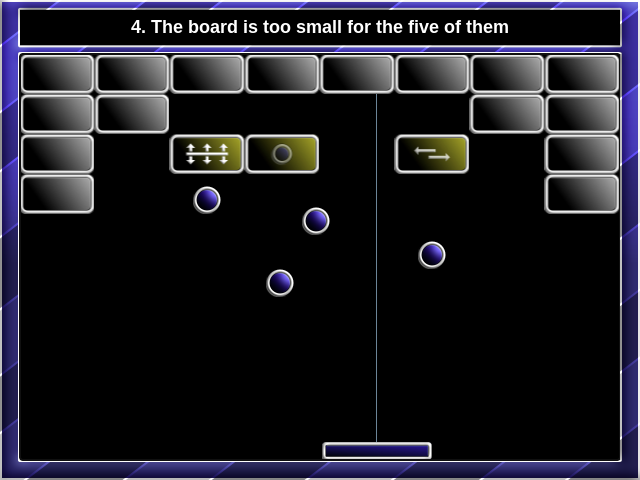

# Brick Destroyer

Brick Destroyer is a 2D game written in JavaScript. The goal is to use a ball to destroy all bricks while keeping physics in mind.

[](https://mokiat.itch.io/brick-destroyer)

You can access the game at the following locations:
- **[itch.io](https://mokiat.itch.io/brick-destroyer)**
- **[GitHub pages](http://mokiat.com/brick-destroyer/index.html)**

## Developer's Guide

You need `node` and `yarn` installed.

1. Download dependencies

    ```sh
    yarn install
    ```

2. Run unit tests

    ```sh
    yarn test
    ```

2. Run web application locally

    ```sh
    yarn start
    ```

## History

Initially developed in Java, this game employed OOP principles to model the various entity types (bricks, slider, ball) in the game and their various behaviors (disappear on hit, destroy neighbours on hit, etc.).

It turned out that the OOP approach was not flexible enough when one wanted to construct more complex levels with bricks that shared common features. This is why I later rewrote the game in JavaScript using the [Entity Component System](https://en.wikipedia.org/wiki/Entity_component_system) design pattern. This opened the door for more diverse levels with custom behavior that could be expressed declaratively.

### Entity Component System

There are various approaches to ECS described online. I decided to follow the approach that I find to be the purest in form. It boils down to the following types.

**Entities** are plain holder objects that contain an ID and a set of Components. They do not have any game logic implemented in them.

**Components** are just data structures. They are assigned to Entities and represent a behavior/feature that an Entity has. Similar to Entities, Components do not have any game logic implemented in them.

**Systems** operate on Entities and Components. Each System implementation operates on Entities that have a given set of Components and performs a particular game logic on them.

In my implementation, I have used an **EventBus** type of communication between the Systems in order to maintain loose coupling.

My implementation of ECS is very simplistic - enough to get a feel for the design pattern. But it gets the job done.
